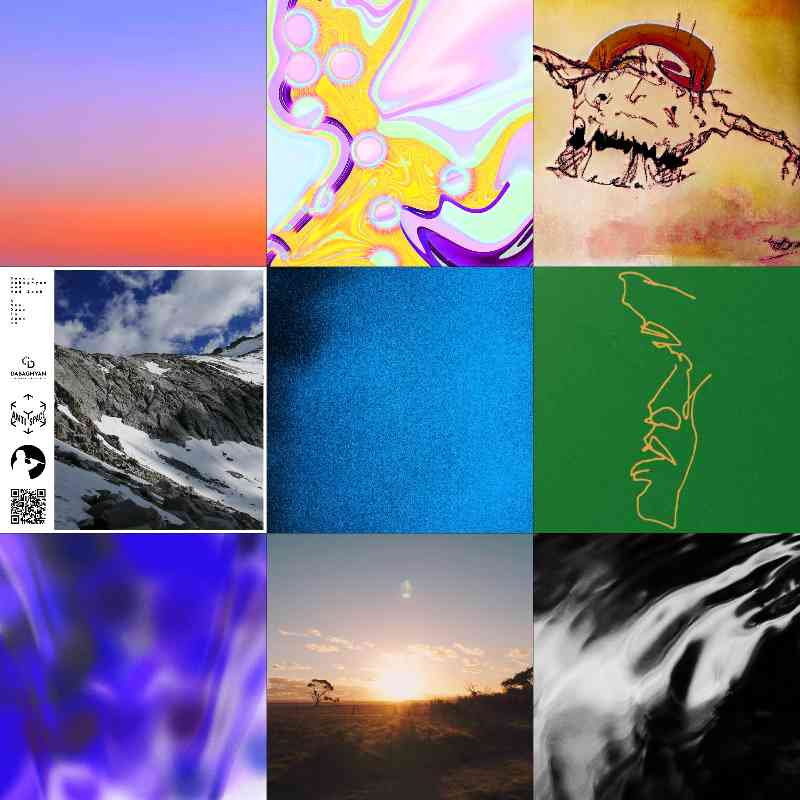
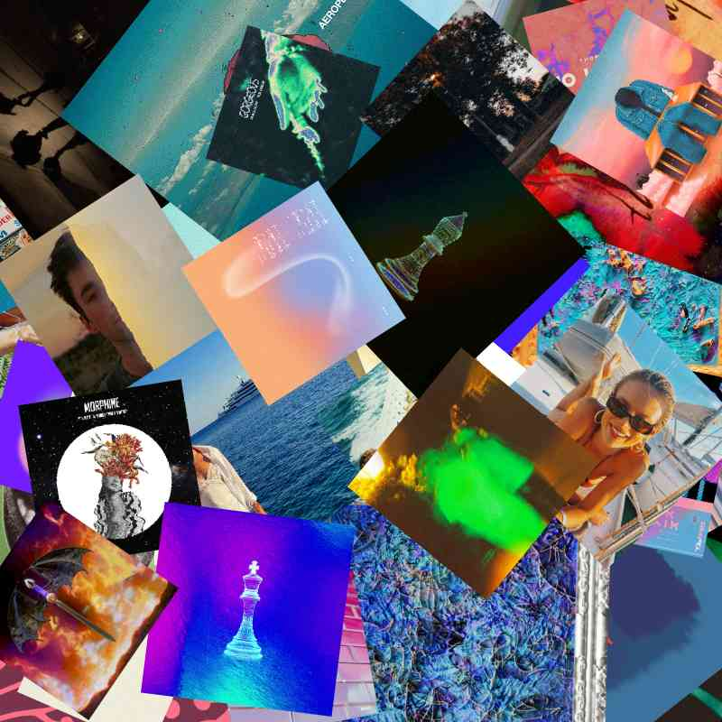

# Choosing An Image

Every playlist needs a good picture.  There are 4 options you can choose from when adding a playlist image:

* Pick an image
* Custom URL
* Generate Collage
* Upload Image

<figure><figcaption>
The 4 main options when picking a playlist image
</figcaption></figure>

### Pick An Image

Choosing Pick An Image gives you a few sets of images to choose from to pick a playlist image.  Those collections are:

* Ape Tapes - Apes as tapes by [Kupeh](https://twitter.com/kupeh_rod).
* Smol Tapes - Wizard tapes by [WizardSmol](https://twitter.com/wizardsmol).
* AI Music stores - A collection of music store images I generated with Midjourney

### Custom URL

You can enter any url that's already on the internet.  If it's an image it will show up and you can choose it.

### Generate Collage

You can generate a clean or dirty collage that is made up of the artwork for the various songs in the playlist. The more tracks the more images.  Once a collage is generated it's uploaded to Arweave, and then set.&#x20;

A clean collage looks like all the artwork is neatly placed on a grid. Example below:

A dirty collage looks like all the artwork is scattered on top of each other. Example below:

### Upload Image

This module lets you select any image on your computer and add that to be the playlist image.  When you add a file, it is uploaded to Arweave, and then set as the playlist image.
